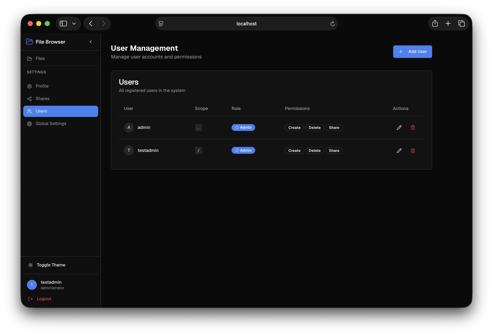
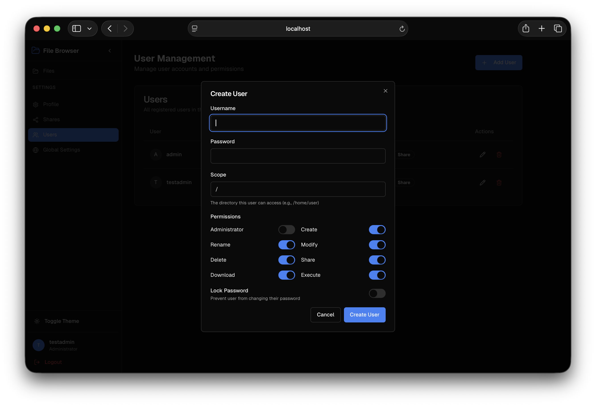
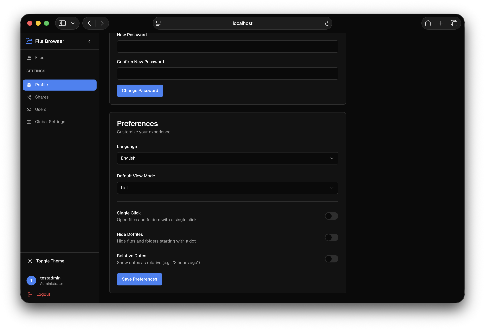
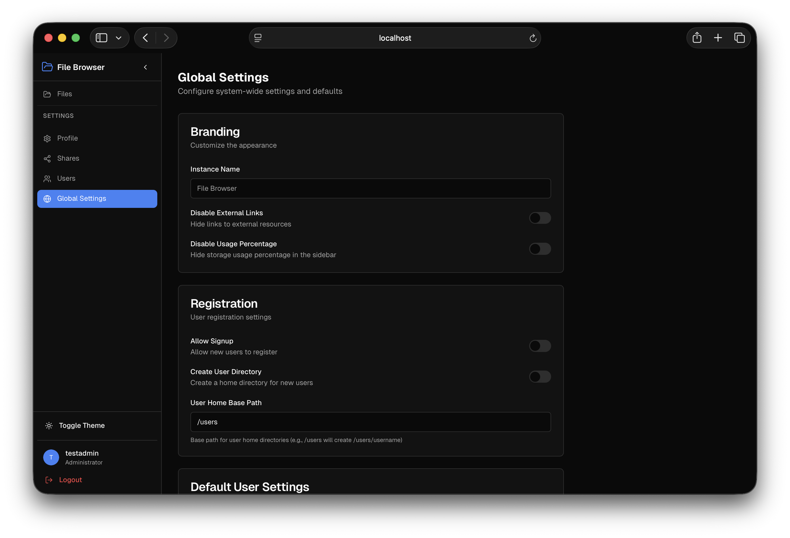
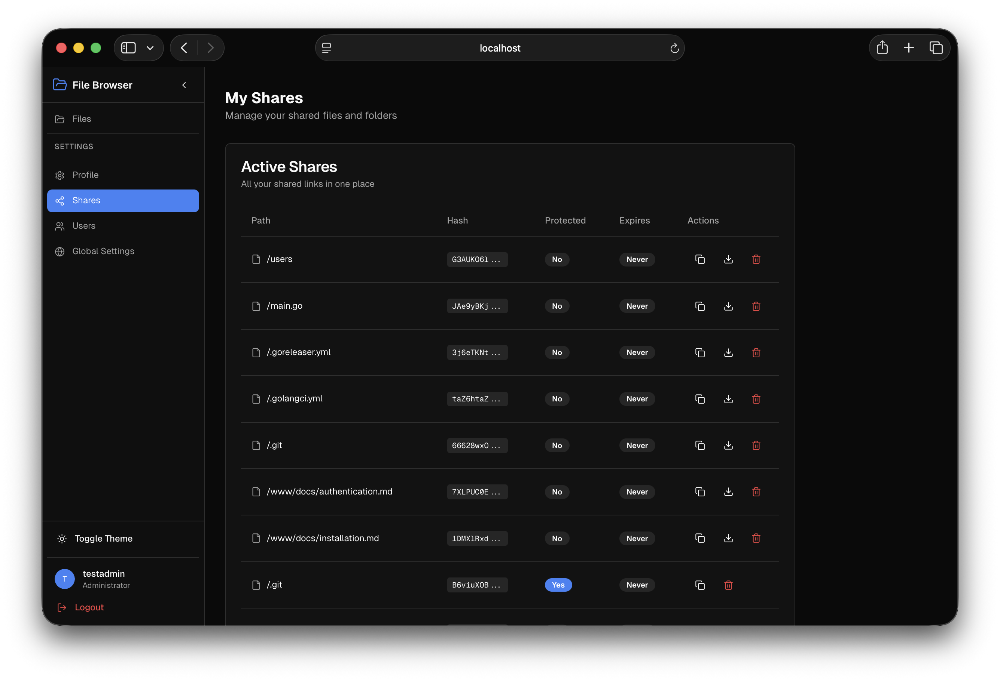
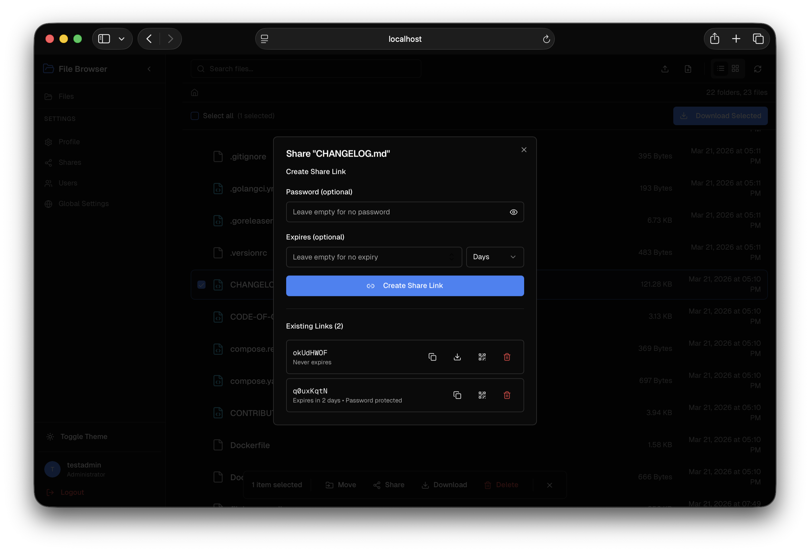

# Features

## User Management

You can manage users, create new users, and set their permissions.

### Users List

  

### Create User

  

## Profile

You can view and update your profile information.

  

## Settings

You can configure the File Browser settings.

  

## Sharing

You can share files and folders with others.

### Shares List

  

### Share Modal

  

